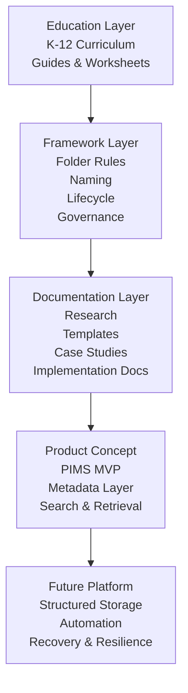

# Acrilus System Overview

```mermaid
flowchart TB
  A[Education Layer
K-12 Curriculum
Guides & Worksheets] --> B[Framework Layer
Folder Rules
Naming
Lifecycle
Governance]
  B --> C[Documentation Layer
Research
Templates
Case Studies
Implementation Docs]
  C --> D[Product Concept
PIMS MVP
Metadata Layer
Search & Retrieval]
  D --> E[Future Platform
Structured Storage
Automation
Recovery & Resilience]
```

## Caption

Acrilus combines education, standards, practical documentation, and a future metadata-driven product direction into one coherent digital life system.
