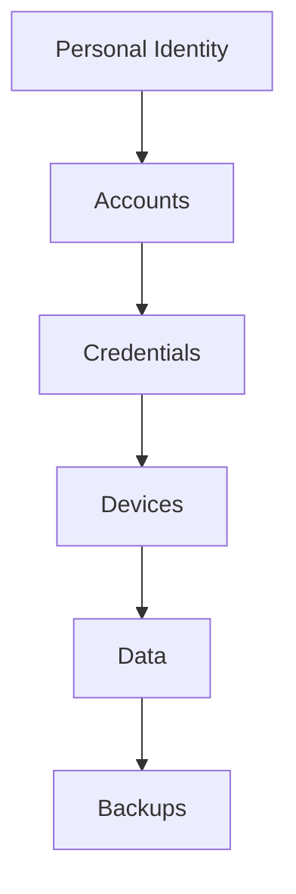

# Personal Digital Life Map Diagram

```mermaid
flowchart TB
  PI[Personal Identity] --> AC[Accounts]
  AC --> CR[Credentials]
  CR --> DV[Devices]
  DV --> DT[Data]
  DT --> BK[Backups]
```

## Caption

The Digital Life Map exposes dependency chains so users can see where lockout or data-loss risk actually concentrates.
