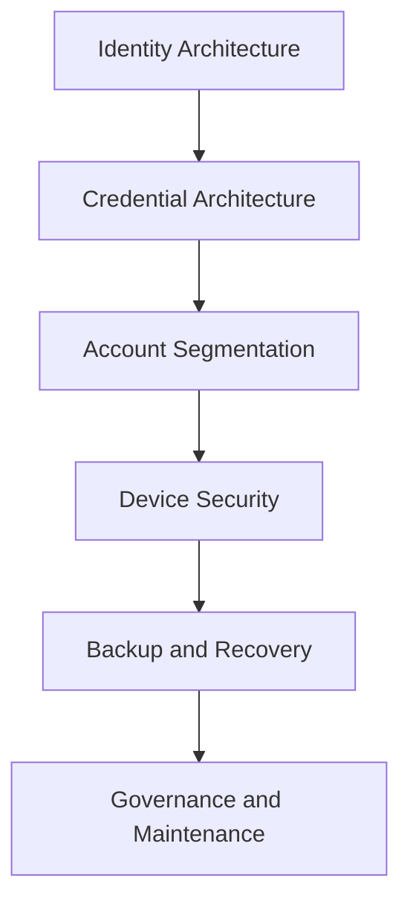

# Personal Digital Security Architecture Diagram

```mermaid
flowchart TB
  I[Identity Architecture] --> C[Credential Architecture]
  C --> A[Account Segmentation]
  A --> D[Device Security]
  D --> R[Backup and Recovery]
  R --> G[Governance and Maintenance]
```

## Caption

Acrilus treats identity, credentials, devices, backups, and maintenance as one system rather than isolated checklists.
