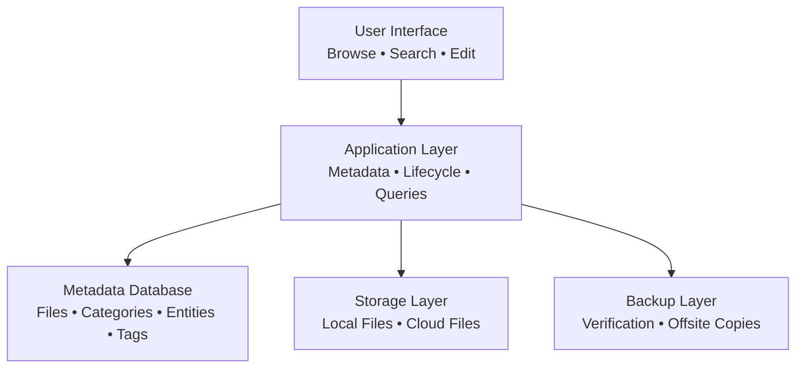

# PIMS Platform Architecture

```mermaid
flowchart TB
  UI[User Interface
Browse • Search • Edit] --> APP[Application Layer
Metadata • Lifecycle • Queries]
  APP --> DB[Metadata Database
Files • Categories • Entities • Tags]
  APP --> ST[Storage Layer
Local Files • Cloud Files]
  APP --> BK[Backup Layer
Verification • Offsite Copies]
```

## Caption

The MVP focuses on a metadata-driven layer on top of existing storage systems rather than building a storage silo first.
